# 🎭 Gen Z Influencer Persona Bot

> **Built:** October 2025

> **Analyzed 1,560 videos from 30 Gen Z influencer channels via Whisper STT + K-means clustering — RAG-powered persona chatbot grounded in 500M+ views of real content**
> YouTube → Whisper STT → K-means clustering → TF-IDF RAG → GPT persona chat · 500M+ views data · Deployed on Railway


---

## 1. Overview

Transcribed 1,560 videos from 30 Gen Z influencer channels using Whisper STT, then clustered channels by lifestyle type via K-means — resulting in 5 synthetic personas, each grounded in real content data. Users chat with these personas through a RAG-powered Streamlit interface to get lifestyle insights backed by actual influencer transcripts.

**Persona Lineup:**
- **Emma** 👩‍🍳: Multi-lifestyle creator (cooking, fashion, art, beauty, travel)
- **Victoria** 🏠: Home & beauty lifestyle (home decor, daily life, pet care)
- **Misha** 📚: Active content creator (reading, journaling, self-improvement, tech)
- **Philip** 📸: Art & craft specialist (photography, art, crafting, cooking)
- **James** 💄: Beauty & fashion expert (beauty, fashion, styling)

**Project Stats:**
- Channels analyzed: 30 Gen Z influencer channels
- Videos processed: 1,560
- STT transcripts: 1,560
- Total views covered: 500M+

---

## 2. Architecture

```mermaid
flowchart TD
    subgraph COLLECT["📥 Data Collection & Processing"]
        YT["🎬 YouTube API v3\nChannel metadata + video list (30 channels)"]
        STT["🎙️ Whisper STT\nAudio → text transcription (1,560 videos)"]
        KM["📊 K-means Clustering\nLifestyle type classification (5 clusters)"]
        PCA["🔭 PCA\n2D visualization & cluster validation"]
    end

    subgraph RAG["🔍 RAG Knowledge Base (per Persona)"]
        CHUNK["✂️ Paragraph Chunking\nSplit into paragraphs (≥50 chars)"]
        TFIDF["📐 TF-IDF Vectorization\n1-2gram, max 1,000 features"]
        COSINE["🎯 Cosine Similarity\nTop-k Retrieval (k=2–3)"]
    end

    subgraph CHAT["💬 Streamlit Chat Interface"]
        UI["🖥️ Multi-persona chat\nTrend analysis | Lifestyle guide"]
        LLM["🤖 GPT-4o-mini\nPrompt assembly → streaming response"]
    end

    YT --> STT --> KM --> PCA
    PCA --> CHUNK --> TFIDF --> COSINE
    COSINE --> UI --> LLM
```



---

## 3. Tech Stack

| Category | Technology |
|----------|------------|
| **LLM** | OpenAI GPT-4o-mini |
| **STT** | OpenAI Whisper |
| **Clustering** | K-means (Scikit-learn) |
| **Dimensionality Reduction** | PCA (Scikit-learn) |
| **RAG Retrieval** | TF-IDF + Cosine Similarity (in-memory) |
| **Frontend** | Streamlit |
| **Data Collection** | YouTube Data API v3 |
| **Visualization** | Plotly |
| **Data Processing** | Pandas, NumPy |
| **Language** | Python 3.x |

---

## 4. Core Logic

### RAG Pipeline (as implemented)

```
1. Whisper STT          → Transcribe YouTube video audio to text
2. Paragraph Chunking   → Split transcripts into paragraphs (min 50 chars)
3. TF-IDF Vectorization → Index with 1-2 gram, max 1,000 features
4. Cosine Similarity    → Score similarity between query and each chunk
5. Top-k Retrieval      → Select top k=2–3 chunks
6. Prompt Assembly      → Combine system prompt + persona info + retrieved context
7. LLM Response         → Generate persona-style response via GPT-4o-mini
```

> **Note:** Current implementation uses TF-IDF in-memory retrieval. The architecture is designed to be swappable to FAISS or ChromaDB for larger-scale deployments.

### Grounding Strategy (Hallucination Mitigation)

| Item | Implementation |
|------|----------------|
| **Similarity Threshold** | Chunks with cosine similarity < 0.1 are excluded from context (`simple_rag_manager.py:166`) |
| **Source Citation** | Retrieved chunks are tagged with persona name and role, surfaced in responses |
| **Graceful Fallback** | If no chunk clears the threshold, an empty context is passed safely |
| **Retrieval-grounded Prompting** | Real transcript content is injected into the prompt to suppress hallucinated answers |

### K-means Clustering

```python
# Vectorize channel metadata + video tags, then classify into 5 clusters
from sklearn.cluster import KMeans
from sklearn.decomposition import PCA

kmeans = KMeans(n_clusters=5, random_state=42)
cluster_labels = kmeans.fit_predict(feature_matrix)

# Reduce to 2D for visualization
pca = PCA(n_components=2)
reduced = pca.fit_transform(feature_matrix)
```

---

## 5. Evaluation

| Metric | Details |
|--------|---------|
| **Retrieval Quality** | TF-IDF cosine similarity score measures retrieval relevance; threshold 0.1 filters out unrelated chunks |
| **Persona Coherence** | Domain keyword match rate per persona — e.g., proportion of Emma's responses containing cooking/fashion keywords |
| **Clustering Validity** | Elbow Method used to select k=5; PCA 2D visualization confirms cluster separation |
| **Future Improvements** | Precision@k measurement, user feedback loop (thumbs up/down), migration to semantic embeddings (OpenAI/SBERT) |

---

## 6. Production Considerations

| Item | Details |
|------|---------|
| **Scalability** | TF-IDF in-memory is suitable for ~1,560 chunks; FAISS/ChromaDB migration required at 100K+ chunks |
| **STT Processing Cost** | Whisper API charges per video; budget planning required for large-scale transcription |
| **YouTube API Quota** | YouTube Data API v3 has a 10,000 unit daily quota; monitor usage during bulk collection |
| **Persona Data Refresh** | New influencer videos require periodic STT re-processing and TF-IDF index rebuilds |
| **Auth Management** | Login credentials managed via `.env` (`AUTH_USER_ID`, `AUTH_USER_PW`, `AUTH_ADMIN_ID`, `AUTH_ADMIN_PW`) |
| **Admin Dashboard** | User activity logs (per-IP access stats, search patterns) available for usage monitoring |

---

## 7. Deployment

### Deploy on Railway

1. Connect the GitHub repository to Railway
2. Set environment variables:
   - `OPENAI_API_KEY` (required)
   - `AUTH_USER_ID`, `AUTH_USER_PW`, `AUTH_ADMIN_ID`, `AUTH_ADMIN_PW`
3. Railway auto-deploys on push

### Local Setup

```bash
git clone https://github.com/pynoodle/vlog-rag-persona-platform.git
cd vlog-rag-persona-platform

pip install -r requirements.txt

# Create .env file
echo "OPENAI_API_KEY=your_key_here" > .env

streamlit run app.py
```

### Environment Variables

```bash
OPENAI_API_KEY=your_openai_api_key   # required
AUTH_USER_ID=user_id
AUTH_USER_PW=user_password
AUTH_ADMIN_ID=admin_id
AUTH_ADMIN_PW=admin_password
```

### Project Structure

```
vlog-rag-persona-platform/
├── app.py                      # Main Streamlit application
├── persona_chatbot_rag.py      # RAG-based persona chatbot
├── cluster_chatbots.py         # Per-cluster chatbot management
├── simple_rag_manager.py       # TF-IDF RAG engine
├── persona_clusters.csv        # K-means clustering results
├── channel_stats.csv           # Channel statistics
├── requirements.txt
├── Procfile                    # Railway deployment config
├── railway.toml
└── README.md
```

---

## 8. Lessons Learned

**TF-IDF vs. Semantic Embedding**
- TF-IDF is simple and free, but has no synonym or context awareness — "cook" and "cooking" are treated as separate tokens
- The right approach: start with TF-IDF to validate the RAG pipeline structure, then upgrade to semantic embeddings once the architecture is proven

**The Importance of Persona Grounding**
- Without a similarity threshold, all chunks are included in context and unrelated content bleeds into responses
- Without a graceful fallback (empty context), retrieval failures trigger hallucinations — safety nets are non-negotiable

**K-means Clustering Limitations**
- K-means requires specifying k in advance, forcing a continuous lifestyle spectrum into discrete buckets
- Elbow method selected k=5, but in practice several influencers fall ambiguously between clusters

**YouTube API Quota Management**
- Hitting the 10,000-unit daily quota during bulk collection of 1,560 video metadata was a real constraint
- Collection scripts should track quota consumption and auto-pause from the beginning

---

**📞 Project Link:** [https://github.com/pynoodle/vlog-rag-persona-platform](https://github.com/pynoodle/vlog-rag-persona-platform)
